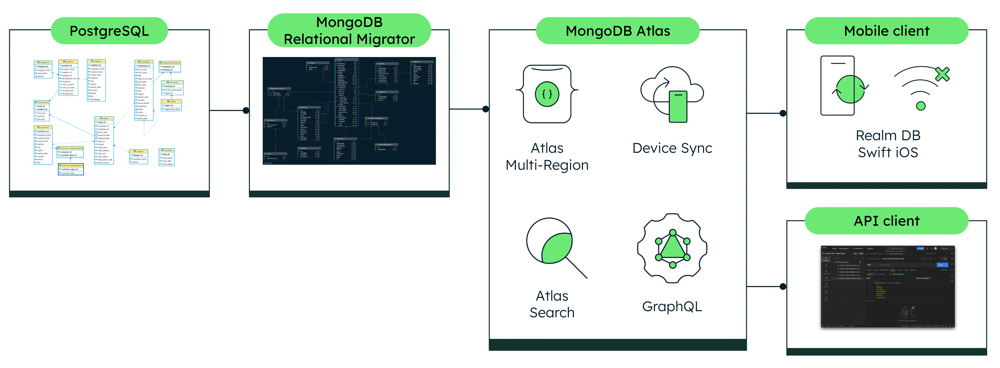
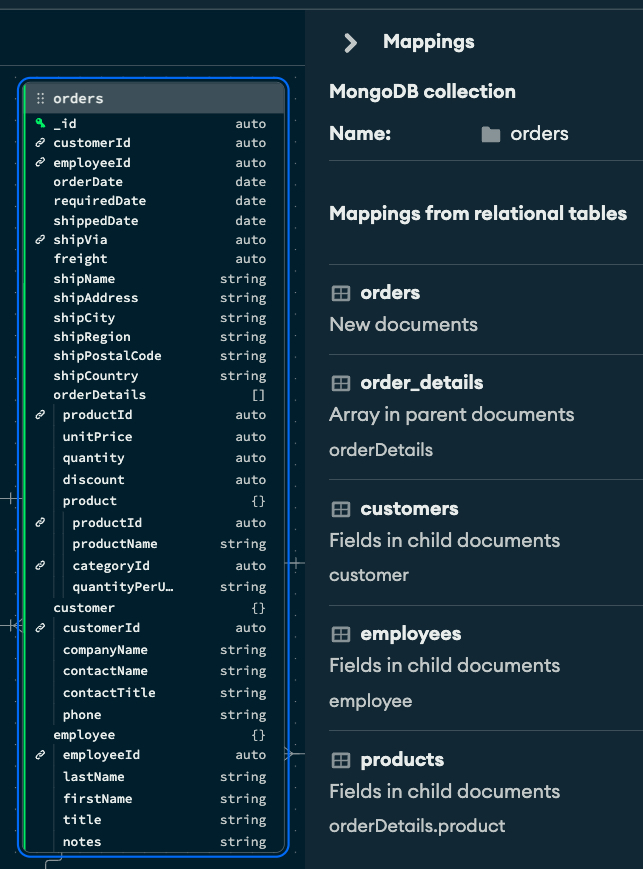
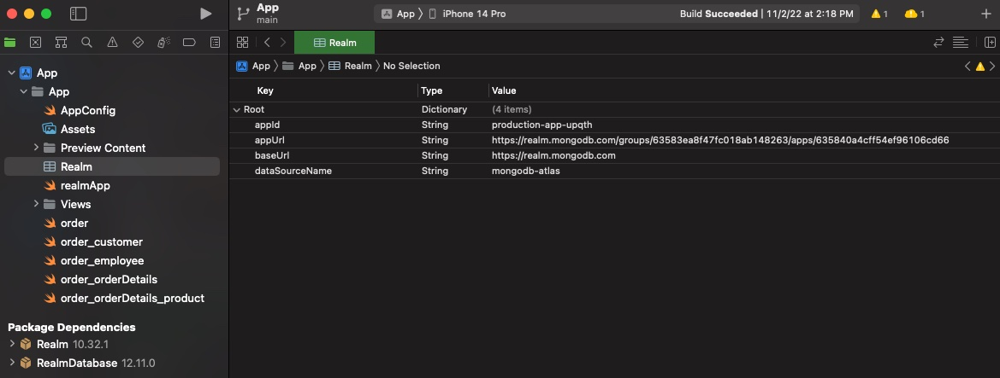

# Liberate your data: From RDBMS to Search, GraphQL & Mobile ... in minutes!

Reduce the time it takes to modernize your applications by freeing the data trapped in your relational database and migrating to the next-gen fully transactional DB of MongoDB Atlas. Powering it with advanced lucene-based search, enable API consumption via fully-managed GraphQL, and expose to mobile and edge consumers via the Realm mobile DB and SDK’s. This demo was created for AWS re:Invent 2022 and presented at the MongoDB booth area at the Venetian expo hall.



Steps
###### PostgreSQL
1. Restore the `northwind` PostgreSQL database using the `restore.sh` script into your postgres host of choice. The instructions assume localhost running on the default port of 5432 with a user named "demo".
2. Verify that the following tables with all data are correctly imported by running this script:

```
WITH tbl AS
  (SELECT table_schema,
          TABLE_NAME
   FROM information_schema.tables
   WHERE TABLE_NAME not like 'pg_%'
     AND table_schema in ('northwind'))
SELECT table_schema,
       TABLE_NAME,
       (xpath('/row/c/text()', query_to_xml(format('select count(*) as c from %I.%I', table_schema, TABLE_NAME), FALSE, TRUE, '')))[1]::text::int AS rows_n
FROM tbl
ORDER BY rows_n DESC;

output
-----------------------------------------
"table_schema","table_name","rows_n"
"northwind","order_details",2155
"northwind","orders",830
"northwind","customers",91
"northwind","products",77
"northwind","territories",53
"northwind","us_states",51
"northwind","employee_territories",49
"northwind","suppliers",29
"northwind","employees",9
"northwind","categories",8
"northwind","shippers",6
"northwind","region",4
"northwind","customer_customer_demo",0
"northwind","customer_demographics",0
```


###### MongoDB Atlas
2. Sign up for Atlas and create an Atlas Project named `Liberate Data`.
3. Create an M10+ Atlas cluster named `production`
4. Create a user named `demo` with `r`eadWriteAnyDatabase` permissions
5. Add `0.0.0.0` to your Atlas IP Access List. NOTE: This is not recommneded for production or professional work environments.
###### MongoDB Relational Migrator
6. Install MongoDB Relational Migrator
7. Import the project `liberate-data.relmig`.
8. Inspect the Relational and MDB diagrams. 
9. The destination Orders collection shoud look like this:

10. Perform the Data Migration entering your Postgres and Atlas credentials. 
11. When done, navigate to Atlas and ensure all collections were migrated. Inspect the `orders` collection. A subset of the data from orderDetails, product, customer & employee should be nested.
###### MongoDB Atlas Search
12. Create a default search indexe with dynamic mappings on the `orders` and `categories` collections. See search-indexes.json for their definition
###### MongoDB Atlas App Services
13. Import the Atlas Application `production-app` into the Atlas project.
14. <b>Linked Data Sources</b>: Inspect that the `production` cluster is linked as the data source
15. <b>Rules</b>: The `orders` collection should have the ` readAndWriteAll` role. All other collections should have the `readAll` role. 
16. <b>Schema</b>: Ensure the schema for all collections is defined. The schema for the `orders` collection should define required fields as below in addition to their bson types:
```
{
  "title": "order",
  "required": [
    "_id",
    "customerId",
    "employeeId",
    "freight",
    "orderDate",
    "shipAddress",
    "shipCity",
    "shipCountry",
    "shipName",
    "shipPostalCode",
    "shipRegion",
    "shipVia",
    "shippedDate"
  ],
  ...
}
```
17. <b>Authentication</b>: 2 authentication providers should be enabled: `email/password` and `API Keys`. An API key named demo should be (re)created by you.
18. <b>Device Sync</b>: Flexible device sync should be enabled, set to the linked atlas cluster and the northwind database.
19. <b>GraphQL</b>: All entity types should be defined along with a custom resolver named `searchOrders` linked to an Atlas Function named `funcSearchOrders`.

###### Postman
20. Install Postman and import the `liberate-data - GraphQL` postman collection.
21. In the collection variables, enter the `api_key` and `atlas_app_id` values. Obtain the GraphQL API endpoint from the GraphQL section and set in the `graphql_api` variable.
22. Execute the 1st POST operation `Auth: Get Bearer & Access Token` to authenticate and obtain a bearer and access token.
23. Execute all other operations in any order. Feel free to change query values.
23. The `Search: Orders by search string` operation uses the custom resolver which in turn executes an Atlas Search pipeline. This pipeline is implemented in the `funcSearchOrders` function. The pipeline performs a fuzzy text search on the `orders` collection, plus a join (`$lookup`) to the `categories` collection performing another search.

###### Swift mobile app with Realm SDK
`This demo uses Swift and the XCode app simulator available on OSX.`
24. Install XCode and open the swift app under the `app-swift` folder. 
25. Open the Realm object and replace the `appId` and `appUrl`. Compile and run.

26. Register a new user using an email and password. 
27. Browse orders. For the purpose of this demo, all users have access to all orders.

###### Atlas Device Sync
28. Modify an order using the mobile app.
29. Open the Order document in Atlas or Compass and notice the changes. Now modify the same order in Atlas or Compass and the changes are reflected on the mobile app. Atlas Device Sync works.
30. Finally, run the MUTATION GraphQL operation in postman. Change the Order ID and any fields in the order body. The changes should reflect in the mobile app.