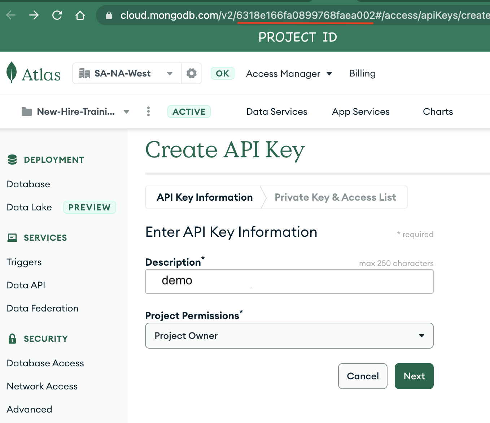

# Liberate your data: From RDBMS to Search, GraphQL & Mobile ... in minutes!

Reduce the time it takes to modernize your applications by freeing the data trapped in your relational database and migrating to the next-gen fully transactional DB of MongoDB Atlas. Powering it with advanced lucene-based search, enable API consumption via fully-managed GraphQL, and expose to mobile and edge consumers via the Realm mobile DB and SDK’s. 


## Prerequisites
* Docker Desktop 4+


## Steps
### Clone & Change Directory
1. ```shell
   git clone https://github.com/mongodb-developer/liberate-data.git && cd liberate-data
   ```

### Create a PostgreSQL instance in Docker
1. Build the image: 
   `docker build -t liberate-data-postgres .`
2. Launch a docker container for the Postgres instance by:
   `docker run -d --name my-postgres -p "5432:5432" -e POSTGRES_PASSWORD=password --rm liberate-data-postgres -c wal_level=logical`
3. Validate the Northwind schema by running this command:

   ```shell
   docker exec -i my-postgres psql -U postgres <<EOF
   WITH tbl AS
   (SELECT table_schema, TABLE_NAME
   FROM information_schema.tables
   WHERE TABLE_NAME not like 'pg_%'
   AND table_schema in ('northwind'))
   SELECT table_schema, TABLE_NAME,
   (xpath('/row/c/text()', query_to_xml(format('select count(*) as c from %I.%I', table_schema, TABLE_NAME), FALSE, TRUE, '')))[1]::text::int AS rows_n
   FROM tbl
   ORDER BY rows_n DESC;
   \q
   EOF

   ```

The output should look like this...

```shell

------------------------------------------------
 table_schema |       table_name       | rows_n 
--------------+------------------------+--------
 northwind    | order_details          |   2155
 northwind    | orders                 |    830
 northwind    | customers              |     91
 northwind    | products               |     77
 northwind    | territories            |     53
 northwind    | us_states              |     51
 northwind    | employee_territories   |     49
 northwind    | suppliers              |     29
 northwind    | employees              |      9
 northwind    | categories             |      8
 northwind    | shippers               |      6
 northwind    | region                 |      4
 northwind    | customer_customer_demo |      0
 northwind    | customer_demographics  |      0

```

#### MongoDB Atlas
2. [Sign up for Atlas](https://www.mongodb.com/cloud/atlas/signup) and create an Atlas Project named `Liberate Data` with an Atlas cluster named `production`.
   3. NOTE: The cluster *must* be named `production`. Otherwise, the `realm-cli push...` command later on will fail
3. Create a user named `demo` with `readWriteAnyDatabase` permissions.
4. Add `0.0.0.0` to your Atlas IP Access List. NOTE: This is not recommneded for production or professional work environments.
#### MongoDB Relational Migrator
5. Install [MongoDB Relational Migrator](https://www.mongodb.com/products/relational-migrator).
6. Import the project [liberate-data.relmig](./relational-migrator/liberate-data.relmig).
7. Inspect the Relational and MDB diagrams. Notice how the `Orders` collection uses the [Subset](https://www.mongodb.com/blog/post/building-with-patterns-the-subset-pattern) schema design pattern to store most frequently accessed data together.
8. The destination Orders collection should look like this:

9. Perform the data migration by entering your Postgres and Atlas credentials.
   10. Postgres Credentials: Username = `postgres` / Password = `password`
10. When done, navigate to Atlas and ensure all collections were migrated. Inspect the `orders` collection. A subset of the data from orderDetails, product, customer & employee should be nested.
#### MongoDB Atlas Search
11. Create a default search index with dynamic mappings on the `orders` and `categories` collections. See [search-indexes.json](./atlas/search-indexes.json) for their definition.
#### MongoDB Atlas App Services
12. Import the Atlas Application [production-app](./app-services/) into the Atlas project.
    13. Download and install the realm-cli
        14. `npm install -g mongodb-realm-cli`
    15. Create an API Key
        16. https://cloud.mongodb.com/v2/PROJECT_ID#/access/apiKeys/create (replace PROJECT_ID with your project id)
        17. Give the key a description and set the project permissions to `Project Owner`
            18. 
        19. Store the public and private keys temp variables
            20. `export PUBLIC_KEY=<Public key copied from Atlas> && export PRIVATE_KEY=<Private key copied from Atlas>`
        21. Authenticate to the realm-cli
            22. `realm-cli login --api-key $PUBLIC_KEY --private-api-key $PRIVATE_KEY`
                23. If prompted with `This action will terminate blah blah blah`, just proceed with `y`
                24. When you see `Successfully logged in`, chances are you're successfully logged in.
    25. Deploy the production-app
        26. `realm-cli push --local app-services/production-app` (execute from the root of this project)
            27. NOTE: If your cluster is not named `production` this command will fail. You'll either have to create a new cluster named `production`, or update the `config.clusterName` in the [config.json](./app-services/production-app/data_sources/mongodb-atlas/config.json)
        28. Accept all the default prompts. The following message indicates success
            ```shell
            Creating draft
            Pushing changes
            Deploying draft
            Deployment complete
            Successfully pushed app up: production
            ```
13. <b>Linked Data Sources</b>: Inspect that the `production` cluster is linked as the data source.
14. <b>Rules</b>: The `orders` collection should have the `readAndWriteAll` role. All other collections should have the `readAll` role. 
15. <b>Schema</b>: Ensure the schema for all collections is defined. The schema for the `orders` collection should define required fields as below in addition to their bson types:
```
{
  "title": "order",
  "required": [
    "_id",
    "customerId",
    "employeeId",
    "freight",
    "orderDate",
    "shipAddress",
    "shipCity",
    "shipCountry",
    "shipName",
    "shipPostalCode",
    "shipRegion",
    "shipVia",
    "shippedDate"
  ],
  ...
}
```
16. <b>Authentication</b>: Two authentication providers should be enabled: `email/password` and `API Keys`. An API key named `demo` should be (re)created by you.
17. <b>Device Sync</b>: Flexible device sync should be enabled, set to the linked atlas cluster and the northwind database.
18. <b>GraphQL</b>: All entity types should be defined along with a custom resolver named `searchOrders`, which itself is linked to an Atlas Function named `funcSearchOrders`.

#### Postman
19. Install [Postman](https://www.postman.com/downloads/) and import the [liberate-data - GraphQL](./postman/liberate-data%20-%20GraphQL.postman_collection.json) postman collection.
20. In the collection variables, enter the `api_key` and `atlas_app_id` values. Obtain the GraphQL API endpoint from the GraphQL section in Atlas App Services and set in the `graphql_api` variable.

21. Execute the 1st POST operation `Auth: Get Bearer & Access Token` to authenticate and obtain tokens.
22. Execute all other operations in any order. Feel free to change query values.
23. The `Search: Orders by search string` operation uses a custom resolver which in turn executes an Atlas Search pipeline. This pipeline is implemented in the `funcSearchOrders` function and performs a fuzzy text search on the `orders` collection, plus a union (`$unionWith`) and join (`$lookup`) to the `categories` collection, thus performing a text search on orders and categories.

#### Swift mobile app with Realm SDK
24. Install XCode with the [Swift](https://developer.apple.com/swift/) SDK, and open the swift app under the [app-swift](./app-swift/) folder. 
25. Open the Realm object and replace the `appId` and  `appUrl`. Compile and run.

26. In the mobile app, register with a new user via an email and password. 
27. Browse orders. For the purpose of this demo, all users have access to all orders.

#### Atlas Device Sync
28. Modify an order using the mobile app.
20. Open the same Order document in Atlas or Compass and notice the changes. Now modify the same order and the changes will be reflected on the mobile app. Atlas Device Sync works.
30. Finally, run the `Mutation: Change a Sales Order` GraphQL operation in postman. Change the Order ID and any fields in the order body. The changes should reflect in the mobile app.